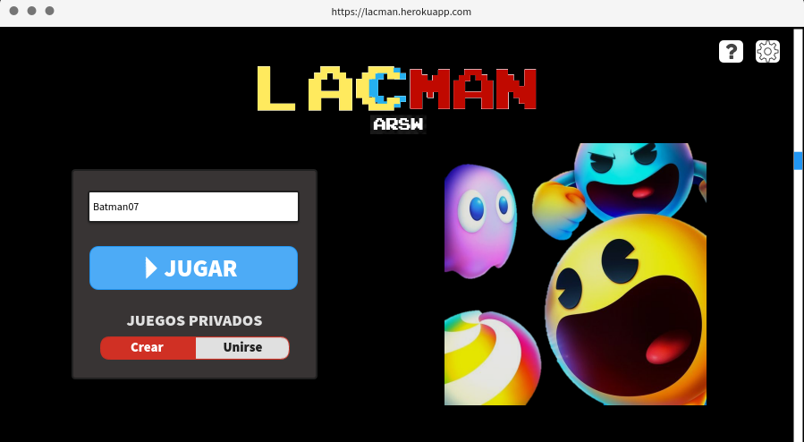
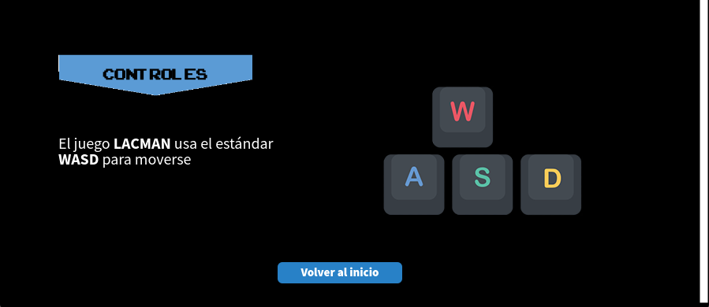
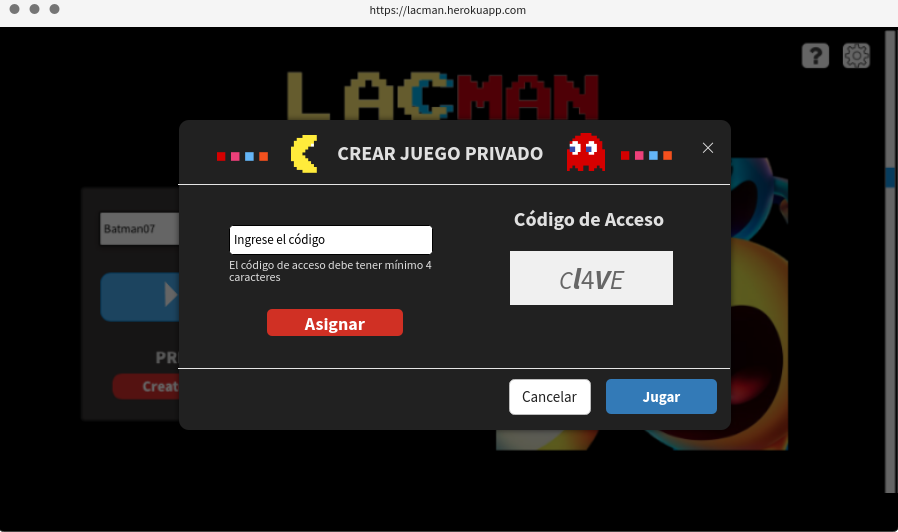
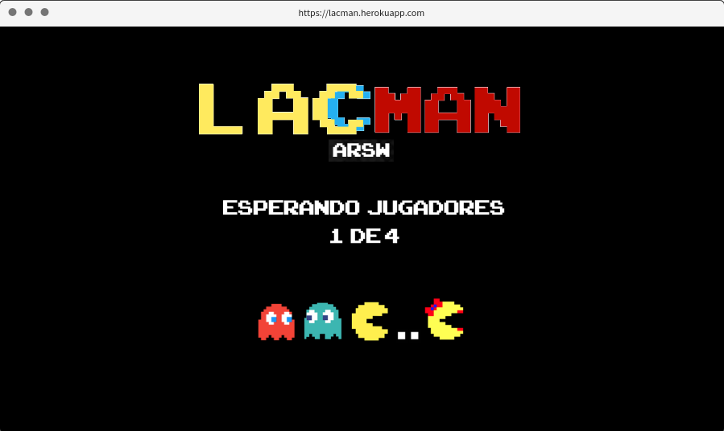
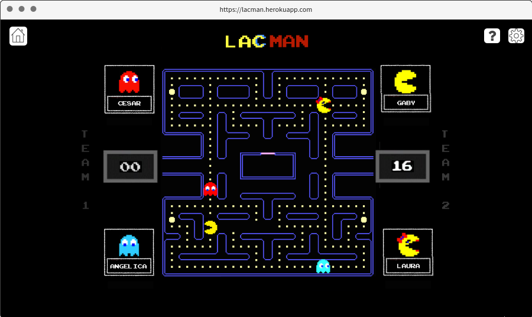
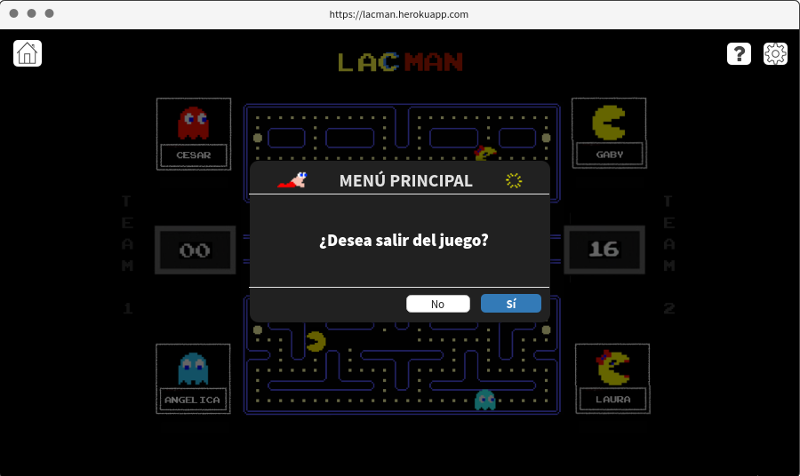
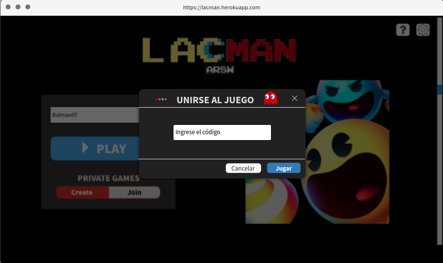
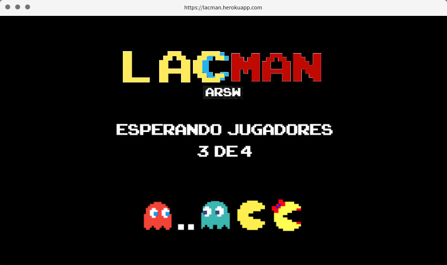
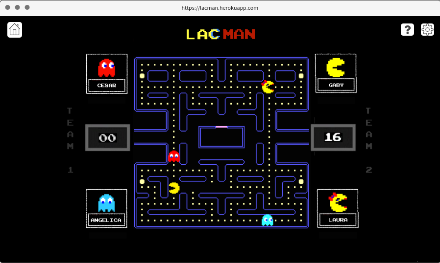

# Escuela Colombiana de Ingeniería Julio Garavito 
# Proyecto ARSW 2021-1

## 📍 LACMAN

#### Product Owner 💥 
>  - Sebastián Henao Pinzón

#### Team 👤👤👤
>  - María Angélica Alfaro Fandiño (Back)
>  - César Fernando Ortiz Rocha (Front)
>  - Laura Alejandra Izquierdo Castro (Design)

### 🔎 Descripción del producto 
**Descripción general:** Juego multijugador (equipos) donde el ganador, es aquel que primero reuna las mayor cantidad de puntos.

**Antecedentes:** PACMAN
  
**Reglas de juego:**
>  - Los equipos inician con la misma cantidad de puntos.
>  - Si un oponente come una superpastilla esta le permite pausar al equipo oponente.
>  - Si dos oponentes cosumen la superpastilla al mismo tiempo,  ninguno es pausado.

### 💡Interfaz del juego

**Mockup Inicio**

**Mockup Create**

**Mockup Join**

### 📜 Arquitectura y Diseño detallado
#### Diagrama de casos de uso
#### Diagrama E-R
**
#### ⭕ Enlace al sistema de integración continua:
#### ⚠️Reporte de de Análisis estático de código:
