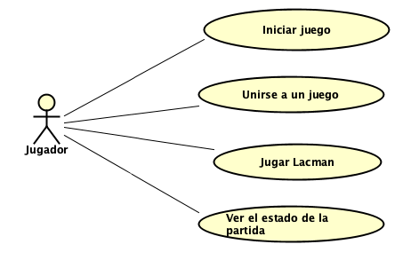
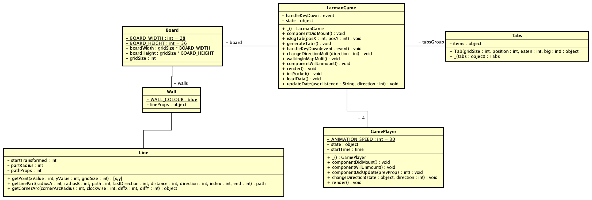
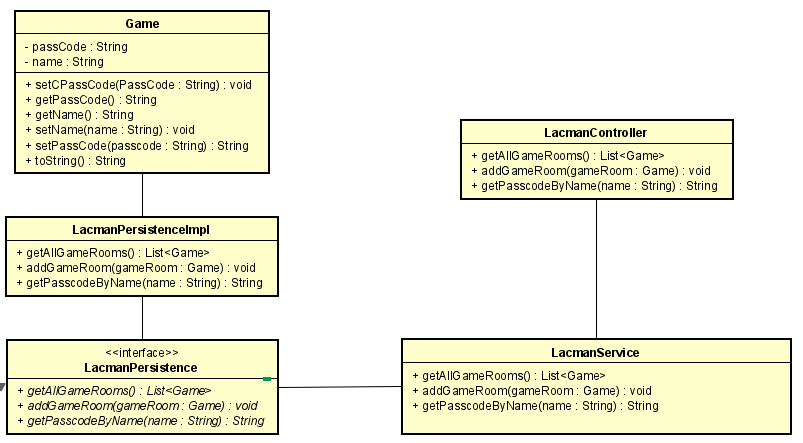
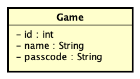
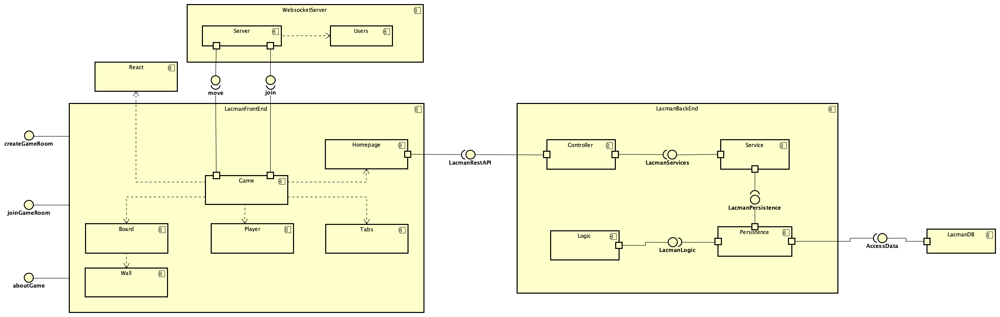
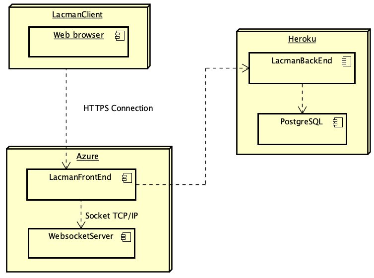

# Escuela Colombiana de Ingeniería Julio Garavito

# Proyecto ARSW 2021-1

## 📍 LACMAN

#### Product Owner 💥

> - Sebastián Henao Pinzón

#### Team 👤👤👤

> - María Angélica Alfaro Fandiño (Back)
> - César Fernando Ortiz Rocha (Front)
> - Laura Alejandra Izquierdo Castro (Design)

### 🔎 Descripción del producto

**Descripción general:** Juego multijugador (equipos) donde el ganador, es aquel que primero reúna las mayor cantidad de puntos.

**Antecedentes:** PACMAN

**Reglas de juego:**

> - Los equipos inician con la misma cantidad de puntos.
> - Si un oponente come una superpastilla esta le permite pausar al equipo oponente.
> - Si dos oponentes consumen la superpastilla al mismo tiempo, ninguno es pausado.

### 📝Manual de usuario: [Ir al manual](https://angelica2802alfaro.gitbook.io/lacman-user-manual/)

### 💡Interfaz del juego

**Mockup Inicio**

<!DOCTYPE html>
<html>
    <head></head>
    <body>
        
        
      
    </body>
</html>

**Mockup Create**

> Al crear un juego deberá ingresar un código de acceso. Una vez lo ingrese, le será confirmado en la misma pantalla para compartir a los demás jugadores que quieran unirse a la partida.

<!DOCTYPE html>
<html>
    <head></head>
    <body>
        
        
        
        
    </body>
</html>

**Mockup Join**

> Al unirse a un juego deberá ingresar el código de acceso. Una vez lo ingrese podrá jugar con sus amigos.

<!DOCTYPE html>
<html>
    <head></head>
    <body>
        
        
        
    </body>
</html>

### 📜 Arquitectura y Diseño detallado

#### Diagrama de casos de uso

#### Diagrama de Clases Frontend

#### Diagrama de Clases Backend

#### Diagrama Entidad-Relación

#### Diagrama de Componentes

#### Diagrama de Despliegue

#### 📈 Enlace a Taiga: [Backlog](https://tree.taiga.io/project/alizeci-arsw-2-2021-1-proy/backlog)

#### 🚀 Despliegue en Heroku: 

#### 🚀 [Despliegue en Azure](https://lacmanmultiplayer.azurewebsites.net)

#### ⭕ Enlace al sistema de integración continua: 

#### ⚠️Reporte de de Análisis estático de código: 
